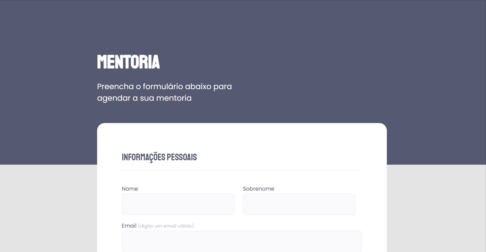

<h1 align="center"> Desafio 03 - Formulário 02 </h1>

 

  

## Sobre o desafio

Este foi outro desafio do curso da rocketseat.   
O objetivo era codificar o formulário disponibilizado no Figma, com o que foi aprendido na aula sobre HTML e CSS.  

## Tecnologias utilizadas

Esse projeto foi desenvolvido com as seguintes tecnologias:

- HTML e CSS
- Git e Github
- Figma